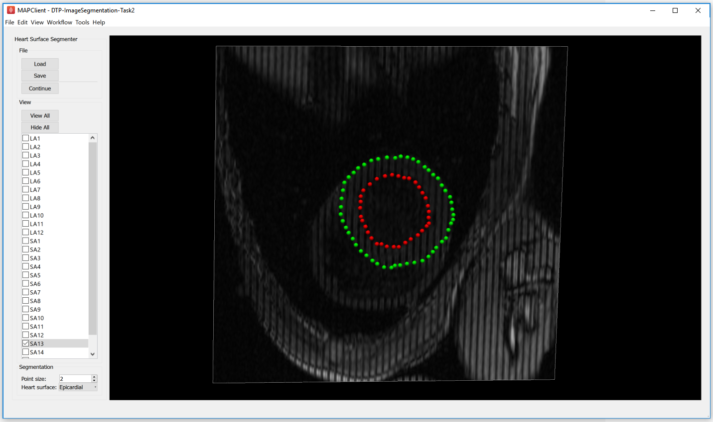
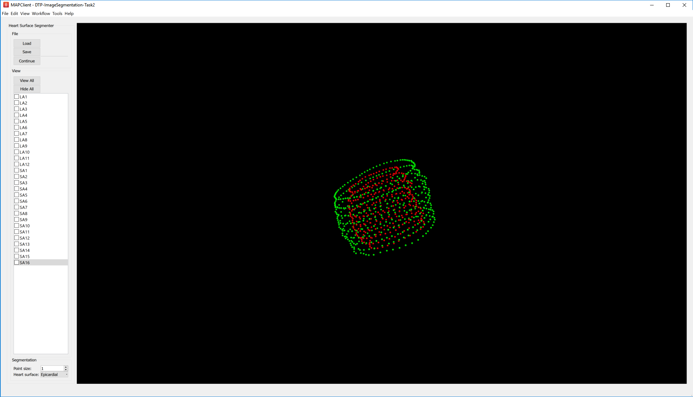
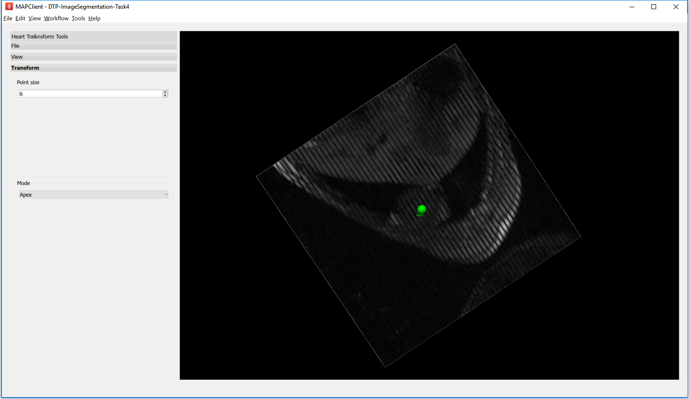

==================
Image Segmentation
==================

This tutorial is on image segmentation and image data post-processing.  The objectives are to gain a basic understanding of the different types of images frequently acquired from medical devices. Understand some of the Digital Imaging and Communications in Medicine (DICOM) standard and the information that is useful to image segmentation.  Gain some knowledge on manual and semi-automatic image segmentation and be aware of the reasons for post-processing segmented data.

Overview
======== 

Segmentation begins with the acquisition of images.  The images used in our domain originate from medical devices.  The types of images that we come across can be roughly divided into two groups **macroscopic anatomical images** and **microscopic anatomical images**.  The macroscopic image modalities that we typically come across are Magnetic Resonance Images (MRI), Computed Tomography (CT) images and Ultrasound (US).  The microscopic images that we use are confocal images.

Most medical devices store their image output using the DICOM standard. The **DICOM standard** is a standard that covers the *handling, storing, printing* and *transmitting* of information in medical imaging.  It includes a file format definition and a network protocol definition.  We shall look at the information that can be stored in the DICOM file format and look at how we can make use of it.

With the information garnered from the DICOM file we will orient and display the images for visualisation, ready for segmentation. The task 1 is to investigate the DICOM headers from a set of tagged MRI images stored using the DICOM standard. In task 2 the segmentation of the images will use a technique called *point-and-click digitiztion*, in task 3 we will perform semi-automatic segmentation using edge detection and edge erosion.  In task 4 we will perform some post-processing on the segmented data to transform the data from the machine or magnet coordinates to heart coordinates.  Finally, we will put it all together to create a segmentation workflow that will produce two point clouds suitable for left ventricle heart model fitting.

Task 1
======

As mentioned above, task 1 is to investigate the DICOM headers from a set of tagged MR images stored using the DICOM standard.  It is quite common to see the DICOM standard used interchangeably with the DICOM image format. It is important to remember that the DICOM standard is not only for the storing of images.  We will use the MAP Client application and load the 'DTP Image Segmentation Task 1' workflow, with the workflow loaded you should see something like :numref:`dtp_cp_seg_tsk1_wkfl`.

.. _dtp_cp_seg_tsk1_wkfl:

   
   Task 1 workflow
   
In this workflow there are *three* steps:

#. The **image source** step from which we will load the DICOM images.
#. The **DICOM header query** step which will be used to query tags from the DICOM image.  
#. The **Python dictionary serialisation** step so that we may store queries for future reference.

When we *execute* this workflow we are presented with :numref:`dtp_cp_seg_tsk1_inte` an interface for querying DICOM headers.
   
   
.. _dtp_cp_seg_tsk1_inte:

   
   DICOM header query interface
   
In :numref:`dtp_cp_seg_tsk1_inte` we can see a number of the GUI elements. On the left of the screen, **[1]** we can see the *DICOM image* that we have chosen to query and two combo boxes(*DICOM Tag* and *DICOM Keyword*) below from which we can select one to perform a query with the identified tag. The *Query* button **[2]** when clicked will query the selected DICOM image with the header tag from the last activated combo box.  The results of the query will appear on the right-hand side **[3]**. On the right-hand side we have four text boxes (*Element name, Element representation, Element value* and *Element multiplicity*) that will be populated with the result of our query.  The element name is related to the DICOM keyword but it is not an exact match, the element representation is defined by the standard and is used to determine the format of the element value. The element value is the actual value of tag queried and the element multiplicity is the number of values in the value element,usually the element multiplicity is one.  When the *Store* button **[4]** 
is clicked,the result of the query is saved to the saved queries table **[5]**, rows in this table maybe deleted by selecting the row to be deleted with the mouse and clicking the *Remove* button.  When the *Done* button  **[6]** is clicked the workflow will finish and return to the workflow edit screen.

The DICOM standard is a rather large and ungainly document freely available on the `web <http://dicom.nema.org/standard.html>`_, of interest to us here is part three of the standard dealing with Information Object Definitions and part six of the standard dealing with the Data Dictionary in particular table 6-1 which relates Tags, Names, Keywords, Element Representation and Element Multiplicity.  If you take a look at table 6–1 you will see that it defines a great number of terms and in any given DICOM file most of these terms will not be defined.  What is of interest here are the tags relating to the image position in relation to the patient, position of the patient, the pixel spacing, the size of the image and the image data itself. It is the values taken from these tags that will enable us to correctly orient the images of the patient when we come to segment the left ventricle in task two. Also available are some data regarding the actual patient and study.

To finish this task, see if you can locate the following information:

#. What is the age of the patient?
#. What is the patient position?
#. Which manufacturer built the equipment?
#. In pixel spacing, what does *DS* in ``Element representation`` signify?

Task 2
======

Task two is to segment the left ventricle of the heart.  Using the MAP Client application again, load the 'DTP Image Segmentation Task 2' workflow.  In this workflow we see five steps - two image source steps,a heart segmentation step and two point cloud serialisation steps.  In this workflow we have two image source steps one for the long axis images and another for the short axis images. We will also differentiate between the endocardial surface and the epicardial surface of the heart which will result in two separate point clouds.

When we *execute* this workflow we are presented with :numref:`dtp_cp_seg_tsk2_init`.

.. _dtp_cp_seg_tsk2_init:

   
   Heart segmentation interface initial state
   
In :numref:`dtp_cp_seg_tsk2_init` we can see on the left a toolbox that allows us to change the state of this segmentation tool, on the right hand side we can see a three-dimensional view of the two sets of DICOM images.  To create this view we have used the the following information from the DICOM header:

 * Pixel spacing
 * Image orientation patient
 * Image position patient
 * Rows
 * Columns
 
This has placed each image plane in the machine or magnet coordinate system.  In the images we are using, you will see lines across the image picture, this comes from the saturated MR signals so that we can track myocardial motion. In the images that we see we have straight saturated bands indicating that these are the reference images.

From the *view* toolbox on the left-hand side we can show the image planes and from the *file* toolbox we can load and save our progress. The done button is also in the file toolbox for when we are finished segmenting.

Using the view toolbox first hide all the image planes and then make the 13th short axis image plane visible. You should now be looking at something very similar to :numref:`dtp_cp_seg_tsk2_13th`.

.. _dtp_cp_seg_tsk2_13th:

   
   View of the thirteenth short axis image plane
   
See the :doc:`3D View Help <threedview>` for help on manipulating the view.  Move the image plane to a more suitable view for segmentation.  We wish to segment both the endocardial and epicardial surfaces of the left ventricle. In the *segmentation* toolbox we can see which surface of the heart we have set up to segment.  In this view the control key is used as a modifier for the left mouse button to add segmentation points to the scene.  With the left mouse button held down we can drag the segmentation points to the desired location.  We can also click on existing segmentation points to adjust their position at a later time.  Segmentation points coloured red will be put into the endocardial set of points, segmentation points coloured green will be put into the epicardial set of points.  Use the heart surface combo box in the segmentation toolbox to change the current point set.

Segmenting this image should result in :numref:`dtp_cp_seg_tsk2_13s`.

.. _dtp_cp_seg_tsk2_13s:

   
   View of the segmented thirteenth short axis image plane
   
Continue segmenting the left ventricle using the long axis images to check for consistency.  The end result should look like :numref:`dtp_cp_seg_tsk2_seg`.

.. _dtp_cp_seg_tsk2_seg:

   
   View of the segmented left ventricle
   
Using the save button from the file toolbox save your progress and click the done button to write the two point clouds to disk.

Task 3
======

.. TODO: Not yet complete

In this task we will use image processing techniques such as edge detection and edge erosion to automatically segment regions of interest. It is often necessary to correct this type of segmentation due to errors in the edge detection or edge errosion process.

Task 4
======

In this task we want to transform the data created in tasks 2 and 3 from machine coordinates to heart or model coordinates.  Open the MAP Client workflow 'DTP Image Segmentation Task 4' and execute it.  You should see the image planes as before.  In this task we need to define the heart coordinate system so that we may contstruct the transformation from machine coordinates to heart coordinates.  We can do this by selecting three landmark points; the Base point, the Apex point, and the RV point.  This will define our heart coordinate system.

From the *transform* toolbox we can set the current point we are positioning.  Starting with the apex point find the location at the lower pointed end of the heart which defines the bottom of the left ventricle volume.  This can be seen the clearest on the 3rd short axis image plane, :numref:`dtp_cp_seg_tsk2_apex` shows the apex point.

.. _dtp_cp_seg_tsk2_apex:

   
   Apex point position in the left ventricle
   
Make only the 13th image plane visible, on this image plane place the landmarks for the base point and the RV point. The base point is the centre of mass of the left ventricle and the RV point is the centre of mass of the right ventricle. See :numref:`dtp_cp_seg_tsk2_brv` for an example of these locations.

.. _dtp_cp_seg_tsk2_brv:

   
   Placement of the base point and RV point
   
With these three landmarks set we can determine the heart coordinate system. The origin of this system is one third of the way down the base to apex line.  The X axis for the system is increasing from the base point to the apex point the, Y axis is increasing from the base point to the RV point and the cross product of these two vectors defines the Z axis. We make this coordinate system orthogonal by projecting the RV-base line onto the base-apex line.

In :numref:`dtp_cp_seg_tsk2_axes` we can see an axes glyph to represent the heart coordinate system.  This glyph should be consistent with the definition from the previous paragraph. 

.. _dtp_cp_seg_tsk2_axes:

   
   Axes glyph representing the heart coordinate system
   
From the file toolbox use the save button to save the location of these points then click the done button to complete this workflow.

Finish
======

To compete this tutorial we shall put together a complete workflow that will start from DICOM images and result in segmented points of the left ventricle in model coordinates.

.. TODO: Complete!